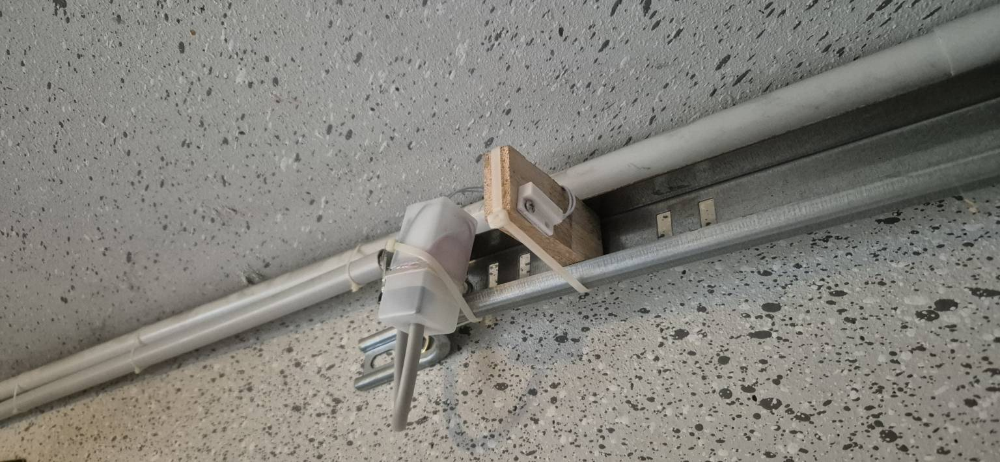
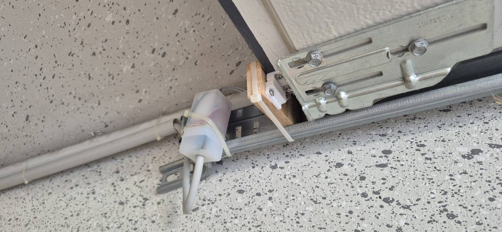

This project solves a simple problem: you want to know if a door (or window, or gate) is open or not. This project toggles a MQTT topic from false to true in case the door opens and back when it closes again.
The superpower of it is the power consumption. The ESP8266 is not powered up all the time and monitoring a switch, but the switch is the power itself. Meaning: when the ESP is powered, the door is deemed as open, and when the power is shut off, the door is deemed as closed.

*Why the heck this way?*

Because now you can use a simple NC ("normally closed") reed switch to power the ESP up when the door meets it's final position (if there is any; my garage gate has one). Once the gate is closed again, the power is shut off. This way the ESP consumes power only while the gate is open.

Of course you can use a NO ("normally open") reed switch and mount the ESP on the closed door, so power is again enabled when opening the door. Or in case your door is normally open and only closed in rare situations, you might build the code the other way round.

*How the heck does that work?*

I'm using a simple feature: MQTT last will. With that you can define a message that will be sent to the MQTT broker once the connection got lost (in fact, the broker stores it from the beginning and sends it itself). So here we actively send the "TRUE" (door open) and define the "FALSE" (door closed) as last will. Once the ESP looses the connection, the last will will be executed. Smart, isn't it?

Be aware that in case the ESP looses the connection for any other reasons than powering down, the flag will be "FALSE" even in case of an open door. So if you depend on being on the safe side, you better change the code so that the ESP declares "FALSE" (close) activly, and anything other is declared as "open".

-----------------------------------------
HOW TO GET IT UP AND RUNNING
-----------------------------------------

__hardware you will need__

- 1x ESP8266 WiFi board, e.g. Wemos D1 mini clone (ESP32 will also work, but then you have to figure out the WiFi on your own because it's slightly different, and it's wasted capability because the task at hand is even far below the capabilities of even the ESP8266)
- 1x reed switch (NC = normally closed or NO = normally open, depends on your installation environment, see above)

Open the garagedoor.c code in your favorite IDE (e.g. Arduino IDE).

__MQTT__

To make MQTT work you have to add your MQTT broker's URL ("mqttServer"), the username ("mqttUsername") and password ("mqttPassword"). You may also want to adjust the topic - by default it's using my structure ("monitor/garagentor").  

__OTA__

The firmware will work fine without any further changes to the code - it will raise errors on the serial console (without consequences), so if you don't want to use OTA (yet), you can skip it completely: If your are interested in it in principle (because the device will probably finally be mounted at an inconvenient location for updates), I recommend to at least adjust the base URL and let the rest unchanged. You can always put a new firmware version at the base URL later to initiate OTA.

Find a file location where you can store the firmware. In my case that's my ioBroker instance, but it can be any URL accessable by the ESP, e.g. a simple file server. It can even be on the internet, but I do not recommend that, because anybody can access it if he knows the URL, and although it's an compiled BIN file, it contains at least your MQTT credentials. And as the ESP8266 is not capable of SSL, it must be an unprotected HTTP URL. So handle with care! Something locally on your LAN is recommended.

Once you have determined the base URL, add it to the code ("baseUrl"). For my ioBroker that would be "http://iobroker:8081/files/0_userdata.0/ota/" (with the name "iobroker" assigned to ioBroker's IP in my Fritzbox router, port 8081 being default for ioBroker, and "/ota" a subfolder I created in the ioBroker files section).

The ESP will look for a file named "fw_ABCDEF.txt" first, with "ABCDEF" the serial number/chip ID of your ESP8266. To determine that, either open the serial monitor when flashing the ESP (see chapter below) - it will print the filenames it looks for on the serial console. You can also look at the logs of your fileserver, it will probably show a warning like "file ESP_ABCDEF.txt asked for, but not found" or similar. ioBroker will do so.

To use OTA, store two files at your base URL:
- fw_ABCDEF.txt contains the version number, starting with 1.0 (current version). Only in case the number in the file is greater than the one in the installed firmware, the ESP will download the new one.
- fw_ABCDEF.bin new firmware. To create it, open the code in your IDE and save the compiled binary file.

For future updates make sure that the new firmware contains the new version number ("CURRENT_VERSION") and the value in fw_ABCDEF.txt is identically to that, otherwise the ESP might end up with endless tries of reinstalling the same firmware over and over.

OTA comes extremely handy once your device is installed near the garage gate, probably somewhere down in your home's electric appliances where it is hard to disconnect and flash with a USB cable for any minor updates. That's the reason I went for OTA.

__WiFi__

Now connect the ESP to your PC, and flash the firmware.

Once it has rebooted, it will look for known WiFi networks (there are none), than it will switch to AP mode. You will see a new WiFi named "garagentor_12345678" (with 12345678 the serial number of your ESP). Connect to it, open http://192.168.4.1 with a browser, choose the WiFi the ESP shall connect to in production, provide the password and confirm. The ESP will reboot and connect to that given network. (This process is provided by the WiFiManager.h library, not my own work.) You can store multiple networks this way in case that might be necessary - probably not that necessary for a stationary device like your garage. 

You should now see the MQTT topic toggling to "TRUE" until you switch off power of the ESP. The last will takes some seconds to be executed (the broker first tries to reestablish the connection), but after the connection timing out, the topic will be set to "FALSE".

Looking forward to your feedback.
